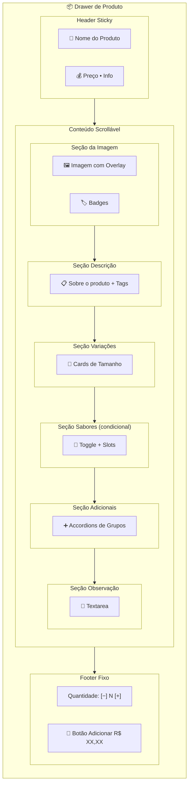

# Redesign do Drawer de Produto - Cardápio Público

## 📸 Análise da Interface Atual

Baseado na imagem fornecida e código analisado, o drawer atual possui:

### Elementos Identificados:

1. **Header**: Título "Pizza Portuguesa" + botão fechar
2. **Imagem**: Foto do produto em aspecto landscape
3. **Descrição**: Texto simples abaixo da imagem
4. **Seleção de Variação**: Dropdown "Escolha uma opção \*"
5. **Checkbox Múltiplos Sabores**: "Adicionar mais sabores?"
6. **Grupos de Adicionais**: Cards clicáveis (Bordas Recheadas, Extras Pizza)
7. **Observação**: Textarea simples
8. **Footer**: Controle de quantidade + botão "Adicionar R$ 35,00"

---

## 🎯 Proposta de Redesign Moderno

### 1. HEADER REDESIGN

#### Atual:

- Título simples alinhado à esquerda
- Botão X no canto

#### Proposta:

```
┌─────────────────────────────────────────┐
│  🍕 Pizza Portuguesa              [X]   │
│  R$ 35,00  •  4 fatias                  │
└─────────────────────────────────────────┘
```

**Melhorias:**

- Adicionar preço e informação da variação no header
- Usar ícone de categoria (se disponível)
- Tornar o header "sticky" com backdrop blur ao scrollar

---

### 2. IMAGEM REDESIGN

#### Atual:

- Imagem retangular com bordas arredondadas simples
- Ocupa toda a largura

#### Proposta:

```
┌─────────────────────────────────────────┐
│                                         │
│         [IMAGEM COM OVERLAY]            │
│                                         │
│    Pizza Portuguesa                     │
│    ⭐ 4.8  •  120 pedidos               │
│                                         │
└─────────────────────────────────────────┘
```

**Melhorias:**

- Imagem em aspecto 16:9 ou 4:3 com bordas mais arredondadas (rounded-2xl)
- Overlay gradiente na parte inferior com informações
- Badge de "Mais vendido" ou "Promoção" se aplicável
- Efeito de zoom suave no hover (se interativo)

---

### 3. DESCRIÇÃO REDESIGN

#### Atual:

- Texto simples cinza

#### Proposta:

```
┌─────────────────────────────────────────┐
│  📋 Sobre este produto                  │
│  ─────────────────────────────────────  │
│  Molho, mussarela, presunto, ovos,      │
│  cebola e azeitonas                     │
│                                         │
│  [Tag: Vegetariano] [Tag: Sem Glúten]   │
└─────────────────────────────────────────┘
```

**Melhorias:**

- Card com fundo sutil diferenciado
- Ícone ilustrativo
- Tags de alérgenos/dietas se disponíveis
- Divider elegante

---

### 4. SELEÇÃO DE VARIAÇÃO REDESIGN

#### Atual:

- Dropdown simples

#### Proposta:

```
┌─────────────────────────────────────────┐
│  📏 Escolha o tamanho *                 │
│  ─────────────────────────────────────  │
│  ┌────────────┐  ┌────────────┐        │
│  │  🍕        │  │  🍕🍕      │        │
│  │  Pequena   │  │  Média     │        │
│  │  4 fatias  │  │  8 fatias  │        │
│  │  R$ 35,00  │  │  R$ 45,00  │        │
│  │  [    ]    │  │  [ ✓  ]    │        │
│  └────────────┘  └────────────┘        │
│                                         │
│  ┌────────────────────────────────┐    │
│  │  🍕🍕🍕  Grande - 12 fatias   │    │
│  │          R$ 55,00     [    ]   │    │
│  └────────────────────────────────┘    │
└─────────────────────────────────────────┘
```

**Melhorias:**

- Cards selecionáveis em grid ao invés de dropdown
- Ícone visual para cada variação
- Preço destacado
- Estado visual claro (selecionado vs não selecionado)
- Animação suave na seleção

---

### 5. MÚLTIPLOS SABORES REDESIGN

#### Atual:

- Checkbox simples
- Seleção de quantidade abaixo

#### Proposta:

```
┌─────────────────────────────────────────┐
│  🔄 Quer dividir seu sabor?             │
│  ─────────────────────────────────────  │
│                                         │
│  [Toggle Switch: Não ▓▓▓▓▓▓▓▓ Sim]      │
│                                         │
│  ┌─────────────────────────────────┐   │
│  │  Quantos sabores?               │   │
│  │  [2]  [3]  [4]                  │   │
│  └─────────────────────────────────┘   │
│                                         │
│  ┌─────────────────────────────────┐   │
│  │  1️⃣  Pizza Portuguesa  ✓       │   │
│  │      (sabor principal)          │   │
│  ├─────────────────────────────────┤   │
│  │  2️⃣  [Selecione um sabor  ▼]   │   │
│  ├─────────────────────────────────┤   │
│  │  3️⃣  [Selecione um sabor  ▼]   │   │
│  └─────────────────────────────────┘   │
└─────────────────────────────────────────┘
```

**Melhorias:**

- Toggle switch moderno ao invés de checkbox
- Seleção de quantidade com segmented control
- Lista vertical de slots numerados
- Visual diferenciado para o sabor principal (fixo)
- Ícones numerados circulares

---

### 6. GRUPOS DE ADICIONAIS REDESIGN

#### Atual:

- Cards clicáveis que expandem
- Select para adicionar itens

#### Proposta:

```
┌─────────────────────────────────────────┐
│  ➕ Personalize seu pedido              │
│  ─────────────────────────────────────  │
│                                         │
│  ┌─────────────────────────────────┐   │
│  │  🧀 Bordas Recheadas            │   │
│  │     Escolha até 1 item          │   │
│  │                         [ ▼ ]   │   │
│  ├─────────────────────────────────┤   │
│  │  ○ Catupiry              +8,00  │   │
│  │  ○ Cheddar               +8,00  │   │
│  │  ● Chocolate            +10,00  │   │
│  └─────────────────────────────────┘   │
│                                         │
│  ┌─────────────────────────────────┐   │
│  │  🥬 Extras Pizza                │   │
│  │     Escolha até 10 itens        │   │
│  │                         [ ▼ ]   │   │
│  ├─────────────────────────────────┤   │
│  │  🧀 Extra Mussarela      +5,00  │   │
│  │     [−] 2x [+]            [🗑️]  │   │
│  │                                 │   │
│  │  🍄 Cogumelos            +4,00  │   │
│  │     [−] 1x [+]            [🗑️]  │   │
│  └─────────────────────────────────┘   │
└─────────────────────────────────────────┘
```

**Melhorias:**

- Accordion/Expandable cards com animação suave
- Ícone ilustrativo para cada grupo
- Radio buttons para grupos single-select
- Stepper (+/-) para grupos multi-select
- Chips/tags para itens selecionados
- Barra de progresso visual "X de Y selecionados"

---

### 7. OBSERVAÇÃO REDESIGN

#### Atual:

- Textarea simples

#### Proposta:

```
┌─────────────────────────────────────────┐
│  📝 Alguma observação?                  │
│  ─────────────────────────────────────  │
│  ┌─────────────────────────────────┐   │
│  │  Ex: Sem cebola, bem passado... │   │
│  │                                 │   │
│  │                                 │   │
│  └─────────────────────────────────┘   │
│  💡 O estabelecimento fará o possível   │
│     para atender seu pedido             │
└─────────────────────────────────────────┘
```

**Melhorias:**

- Card com borda sutil
- Placeholder mais amigável
- Hint text abaixo
- Contador de caracteres (opcional)

---

### 8. FOOTER REDESIGN

#### Atual:

- Contador simples com botões + e -
- Botão de adicionar

#### Proposta:

```
┌─────────────────────────────────────────┐
│  ━━━━━━━━━━━━━━━━━━━━━━━━━━━━━━━━━━━━  │  ← Divider
│                                         │
│  Quantidade:    [−]  2  [+]             │
│                                         │
│  ┌─────────────────────────────────┐   │
│  │  🛒  Adicionar ao carrinho      │   │
│  │      R$ 70,00                   │   │
│  └─────────────────────────────────┘   │
└─────────────────────────────────────────┘
```

**Melhorias:**

- Stepper de quantidade mais compacto
- Botão de ação full-width com ícone
- Preço total destacado no botão
- Animação de pulse no botão quando pronto
- Divider visual superior

---

## 📐 Estrutura Visual Proposta (Mermaid)



---

## 🎨 Diretrizes de Design (Sem alterar cores)

### Espaçamento:

- **Section gap**: 24px (space-y-6)
- **Inner gap**: 16px (space-y-4)
- **Card padding**: 16-20px (p-4 ou p-5)
- **Element gap**: 12px (gap-3)

### Bordas:

- **Cards**: rounded-2xl (16px)
- **Botões**: rounded-xl (12px)
- **Inputs**: rounded-lg (8px)
- **Ícones/Badges**: rounded-full

### Sombras:

- **Cards selecionados**: shadow-lg
- **Cards hover**: shadow-md
- **Botão primário**: shadow-lg

### Tipografia:

- **Títulos de seção**: font-semibold, text-base
- **Labels**: font-medium, text-sm
- **Descrições**: text-sm, text-muted
- **Preços**: font-bold, text-lg

### Estados Visuais:

- **Selecionado**: border-primary, bg-primary/10, shadow-lg
- **Hover**: border-primary/50, shadow-sm
- **Default**: border-default, bg-secondary
- **Disabled**: opacity-50, cursor-not-allowed

---

## ✅ Checklist de Implementação

### Componentes a Modificar:

1. **CardapioProdutoDrawer.vue**
   - [ ] Reestruturar layout do header
   - [ ] Redesign da seção de imagem
   - [ ] Criar componente de seleção de variação em cards
   - [ ] Redesign do toggle de múltiplos sabores
   - [ ] Criar accordion para grupos de adicionais
   - [ ] Redesign do footer

2. **CardapioProdutoBottomSheet.vue**
   - [ ] Aplicar mesmas mudanças adaptadas para mobile
   - [ ] Otimizar espaçamentos para tela menor
   - [ ] Ajustar tamanhos de touch targets

3. **Componentes UI (se necessário)**
   - [ ] Verificar se UiSelect precisa de variantes visuais
   - [ ] Verificar se UiButton precisa de ajustes

### Animações Sugeridas:

- Transição suave na seleção de variações (200ms)
- Expand/collapse dos accordions (300ms ease-out)
- Scale no botão de adicionar ao hover (105%)
- Fade-in dos slots de sabores quando ativados

---

## 🚀 Próximos Passos

1. **Validar proposta** com o usuário
2. **Criar protótipo** em código (Code mode)
3. **Testar responsividade** em diferentes telas
4. **Ajustar interações** baseado em feedback
